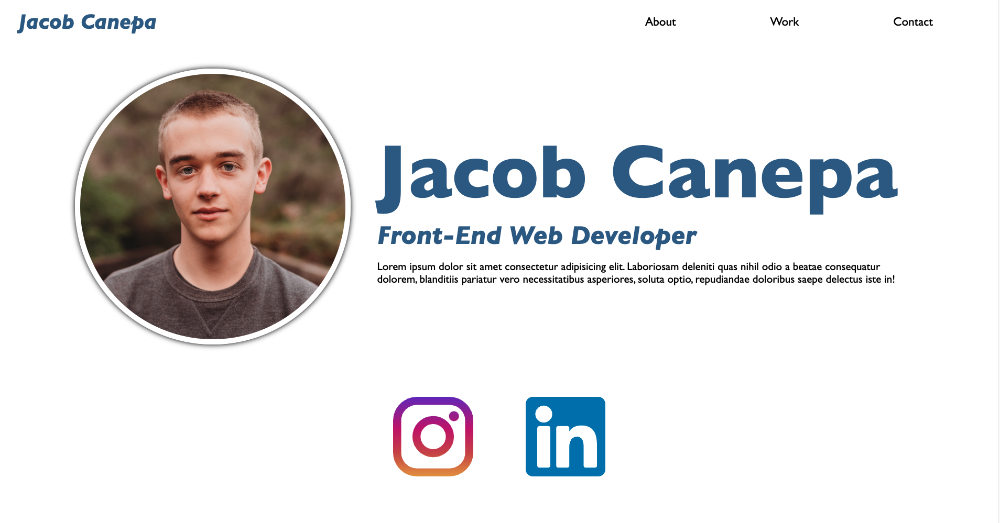

# Jacob Canepa Portfolio

This week's challenge I was asked to build myself a portfolio from scratch. I really enjoyed this challenge as it allowed me to use all the new skills I learened and apply them how I wanted to. While this was a real test of my skills, the resources provided to me from this class and Google helped me power through. I would say the most challenging part of this project was making everything responsive to different resolutions.

https://jacobmcanepa.github.io/portfolio/
